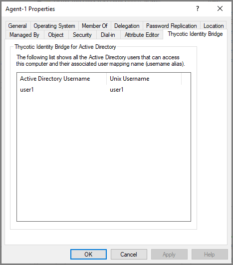

[title]: # (Computers)
[tags]: # (mmc)
[priority]: # (5)
# Thycotic ID Bride - Computers

The Thycotic Identity Bridge panel under group properties of ADUC, displays a list of all the Active Directory users that can access this computer and their associated user mapping name (username alias).

