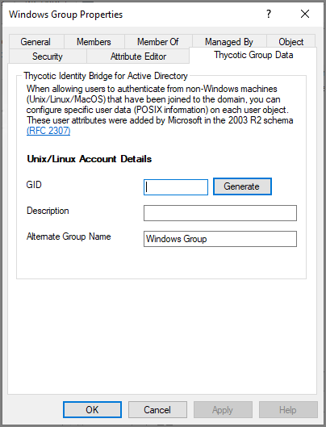

[title]: # (Group Data)
[tags]: # (mmc)
[priority]: # (5)
# Thycotic Group Data

The Thycotic panels under group properties of ADUC allows you to manage the ID Bridge components related to Linux/Unix user attributes

## GID Number

* This is the unique group id number assigned to each AD group account, which is assigned to a user account for accessing Linux/Unix agents.

## Generate

* The Generate button will create a unique GID Number in accordance to the chosen method for that group account.
* GID’s will not be re-used.
* The generated GID value will be greater than the Starting GID defined in the ID Bridge Configuration utility.
* If the User has a GID Number the generate button will not create a new GID.

## Algorithmic/Incremental drop-down

* Selects the method applied to creating the GID Number
* Algorithmic - algorithm based GID generation
* Incremental - Add ones to the last allocated GID
<!--
## Description

* Allows a description of a Group to be defined
* Field limit is defined in AD schema. Thus no limit will be enforced in the GUI. If limit is exceeded, data will fail to save and a message will be shown to the user.  -->

## Alternative Group Name

* Provides a Linux/Unix appropriate display name of the Active Directory group.
* Field limit is defined in AD schema. Thus no limit will be enforced in the GUI. If limit is exceeded, data will fail to save and a message will be shown to the user.  

<!-- ## Force Home Directory Permissions

* When checked this option will ensure that upon a user logging into the Linux/Unix host that the permissions on the Home directory are correctly set to reflect the UID and GID define for the user.
* A difference could arise when a local user exists with a matching AD user, therefore the home directory would of been previously created with permissions associated with the local users UID/GID

## Sync local password (Linked accounts only)

* If the user has a local Linux/Unix account with a stored password, it will sync the password across from AD to the local store in the event the agent ever falls back to local authentication methods. -->
