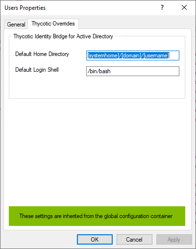
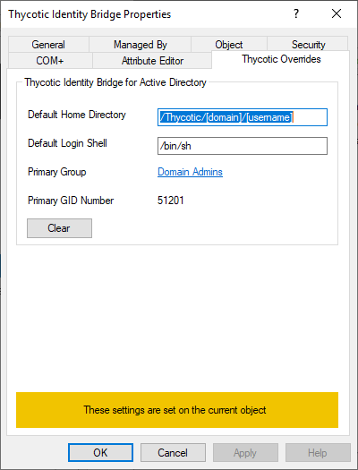
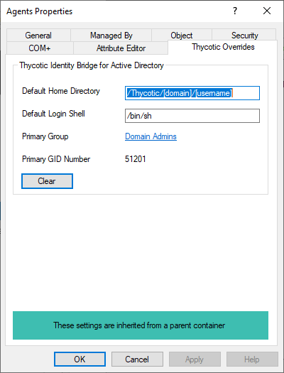

[title]: # (OUs)
[tags]: # (mmc)
[priority]: # (5)
# Thycotic Overrides

The Thycotic Overrides panel under OU properties of ADUC allows you to override some of the POSIX user fields normally set Globally in the Thycotic Configuration Utility or Individually under ADUC User Properties.

These will then be used as the default values for any users created under that OU.

When using the global configuration a banner will be displayed.

## Default Home Directory

* Defines the home location of the user when they log into the Linux/Unix agent.
* This is normally their landing folder.

## Default Login Shell

Defines the Linux/Unix shell that will be assigned to that user on login.

## Primary Group

* Opens the AD Group Modal to search and select an AD group to be assigned as Primary Group for the user account.
* Only one group can be selected and assigned at a time.
* If a group is selected that doesn’t have a Primary GID, you will be presented with the Thycotic GID generation modal.

## Primary GID

The GID number of the Primary group assigned to the user.

## Clear

A __Clear__ button is available with an override implemented on an OU Container. When clicked, the OU overrides are cleared and default back to the Global values as defined in the Thycotic Configuration Utility.

## Inherited

When viewing any child OU properties with an override in place on an OU Container, a message is display that it’s Thycotic Overrides are inherited from the parent container.

The Clear option is also available to default back to the Global values as defined in the Thycotic Configuration Utility.

