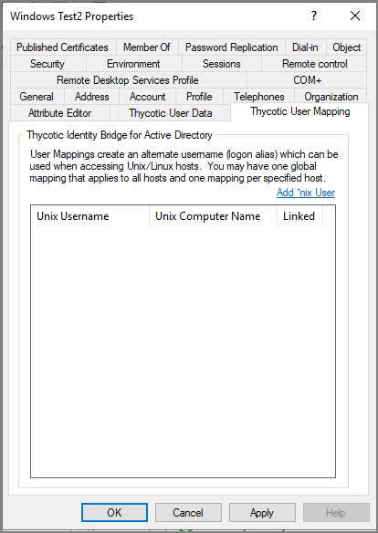

[title]: # (User Mapping)
[tags]: # (mmc)
[priority]: # (4)
# Thycotic User Mapping

User Mappings create an alternate username (logon alias) which can be used when accessing Unix/Unux hosts. You may have one global mapping that applies to all hosts and one mapping per specified host.

## Add *nix User

Open a modal with a free text username field and optional hosts selection field.