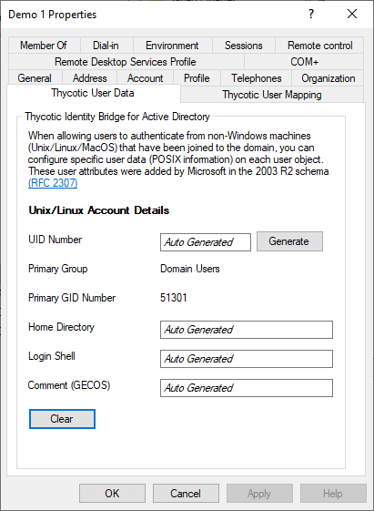
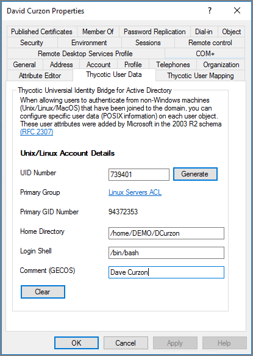
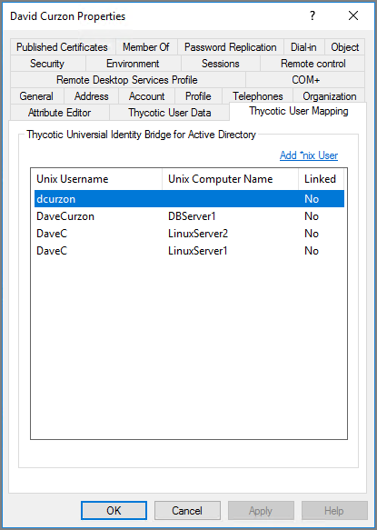
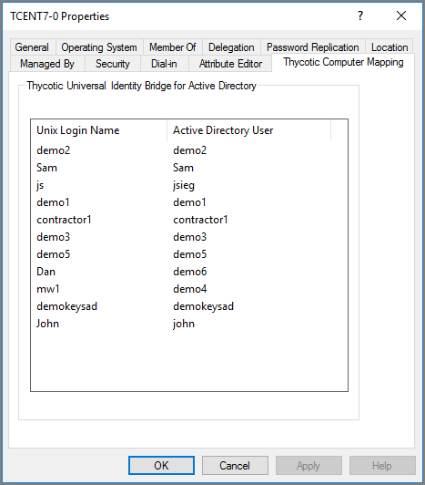

[title]: # (User Data)
[tags]: # (mmc)
[priority]: # (4)
# Thycotic User Data

The Thycotic panels under user properties of ADUC allows you to manage the ID Bridge components related to Linux/Unix user attributes.

## Auto Generated

When the POSIX Data for the Users & Groups field in the Thycotic Configuration Utility is set to Automatic the user fields will be displayed with Auto Generated, meaning when the user accesses a Linux/Unix host the fields will automatically be generated.

Mousing over the fields will display the parameters that have been assigned to that field.

These fields can be manually overridden and will display as such once saved.

## UID Number

* This is the unique user id number to both the active directory forest and each AD user account for accessing Linux/Unix agents.

## Generate

* The Generate button will create a unique UID Number in accordance to the chosen method for that user account.
* UID’s will not be re-used
* The generated UID value will be greater than the Starting UID defined in the ID Bridge Configuration utility
* If the User has a UID Number the generate button will not create a new UID

## Primary Group

Opens the AD Group Modal to search and select an AD group to be assigned as Primary Group for the user account.

* Only one group can be selected and assigned at a time.
* If a group is selected that doesn’t have a Primary GID, you will be presented with the Thycotic GID generation modal.

## Primary GID

* The GID number of the Primary group assigned to the user

## Home Directory

* Defines the home location of the user when they log into the Linux/Unix agent.
* This is normally their landing folder.

## Login Shell

* Defines the Linux/Unix shell that will be assigned to that user on login.

## Comment (GECOS)

* Gecos is are short text fields in /etc/passwd of the Linux/Unix Agent that keeps the users real name

<!--## Unix Username (optional)

* This allows you to define a simplified username that AD users will be able to login to the Linux/Unix Servers with.
* By default AD users would need to login with a format of <user1@domain1.com>, this fields allows you to define a username such as user1. then the login would become user1

## Force Home Directory Permissions

* When checked this option will ensure that upon a user logging into the Linux/Unix host that the permissions on the Home directory are correctly set to reflect the UID and GID define for the user.

* A difference could arise when a local user exists with a matching AD user, therefore the home directory would of been previously created with permissions associated with the local users UID/GID.

## Sync local password (Linked accounts only)

* If the user has a local Linux/Unix account with a stored password, it will sync the password across from AD to the local store in the event the agent ever falls back to local authentication methods.

## User Mapping

-->
