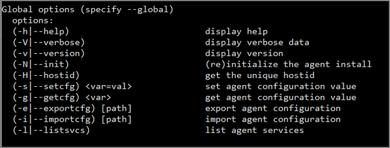
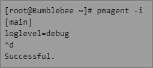

[title]: # (GlobalCommands)
[tags]: # (panel)
[priority]: # (11)
# Global Commands



## Prerequisites

Users need to have root access or root sudo permissions.

## Agent Global Commands

Once your Thycotic Agent has been installed you have a number of Global options available which can be run directly after typing __pmagent__ and are identified below.

| **Command line Option**  | **Description** | **Notes** |
| ----- | ----- | ----- |
| -h \| --help | Displays the pmagent options output | |
| -V \| --verbose | Displays verbose data | Normally used in conjunction with options such as -v |
| -v \| --version | Displays the installed version of the Thycotic agent | Example output: `1.0.0` |
| -N \| --init | Re-initializes the agent installation | The agents configuration settings are all stored in \|etc\|pma.conf in the event this file is removed or you wish revert to a default configuration as per the installation then this option will regenerate the pma.conf |
| -H \| --hostid | Displays the unique host ID | Displays the unique value created by the operating system that identifies the machine. |
| -s \| --setcfg <var=val> | Updates an individual agent configuration setting | The variable component is in the format of `section.field=new value` |
|  | | Example of use: `pmagent -s main.loglevel=debug` |
| -g \| --getcfg <var> | Displays an individual agent configuration setting | The variable component is in the format of `section.field=new value` |
|  | | Example of use: `pmagent -g main.loglevel` |
|  | | The output will displayed as: `main.loglevel=warning` |
| -e \| --exportcfg [path] | Exports the current agent configuration in ini format | Without the path defined will display all the current configuration settings of the agent to screen. |
|  | | Using the path option, all the current configuration settings of the agent will be exported to the file you define in a readable ini format |
| -i \| --importcfg [path] | Imports an updated set of agent configuration settings from a specified file in ini format | Import files are required to be in the same format as the export If no file is defined in the command line the user is entered into an editor mode, where it you can define configuration settings. |
|  | | Once entered into the editor you define the settings by entering the settings as per the expected format. To complete the edit and exit the user will press the letter d along with holding down the CTRL key. A success message should be displayed to inform that the update was successful. |
|  | |  |
| -l \| --listsvcs | lists the agent services currently active on the agent | Detailed information regarding the different services the Thycotic agent is currently providing and monitoring. |

Example of __-l | --listsvcs__ global command following the install of pmagent:
```bash 
    task: pmagent_registration
    key: register
    when: 2020-06-22 08:00:56
    reoccurs: 60s
    maxretries: forever
    backoff: yes
    attempts: 0
    expires: 2262-04-12 00:47:16
    last tried: never
```
