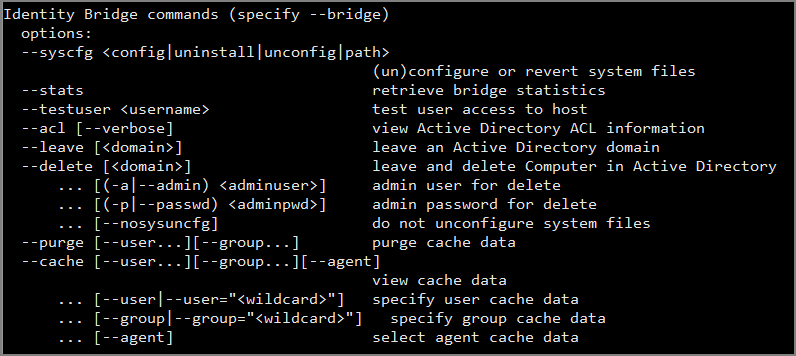

[title]: # (Commands)
[tags]: # (panel)
[priority]: # (1)
# Identity Bridge Commands



## Prerequisites

Root access or a user with root sudo permissions.

## --bridge Command Line Options

Once your Thycotic Identity bridge agent has been joined to Active Directory there are a number of other commands that you can utilise in conjunction with the __--bridge__ option and these are identified below

### --syscfg <config|unconfig|uninstall|path>

Allows you to configure/unconfigure the hosts native authentication files for the Thycotic system configuration files to authenticate against your Active Directory Domain.

Thycotic uses json scripts to modify the hosts original authentication files. Before any __--syscfg__ configuration any files to be modified are backed up. The Path option allows you to define an alternative json script to be used for the configuration of the hosts authentication files. This would be used when customers have specific alterations already defined on their hosts.

The default Thycotic scripts can be found in:
* /opt/thycotic/scripts

Files currently modified by __--syscfg__:

* /etc/pam.d/password-auth
* /etc/pam.d/passwd
* /etc/nsswitch.conf
* /etc/ssh/ssh_config
* /etc/ssh/sshd_config

If password-auth, passwd or nsswitch.conf are found to be missing during a --syscfg config the process will be aborted and the user informed that a required system file is missing. ssh_config and sshd_config are not required files.
If missing during a --syscfg unconfig\uninstall the process will continue and modify\replace any files still available.

The uninstall option will instead of modifying the existing system file simply use the .thyorig backups created when create was run and reset the system files to how they were originally.

The unconfig will modify the existing files creating a .thybak backup first.

In the event the .thyorig files are missing the agent will fallback to performing a modifying the existing files.

### --stats

Provides on screen feedback of the status of the agent, including Process Id and currently active AD instance.

Useful commands to check under which OU the agent is defined and running.

### --testuser <username>

Performs and Active Directory check of the user status against the agent. 

The following statuses can be returned:

* Access Allowed
* Account Disabled
* Account Expired
* Account Locked
* Thycotic ACL denied access and User doesn't exist

### --acl [--verbose]

Displays the Access Control List for the Agent. Displays a list of Active Directory user that are able to access the Agent in accordance with the Thycotic ACL policy defined in the Configuration Utility.

Optional: --verbose will display the users assigned to a Group in the ACL list.

### --leave [<domain>]

Leaves the Active Directory domain, although leaving the computer object in Active Directory. As the leave process completes the --syscfg uncfg will be run, reverting the host back to its original authentication configuration and removing the Thycotic system configuration files.

Leave will clear all Active Directory setting on the host, it will clear all cached information. Defining the Domain is not required, if not defined the agent will use it’s stored details for the Domain.

Optional: `--nosysuncfg` stops the removal of the Thycotic system configuration files.

Do not unconfigure system files.

### --delete

Leaves the Active Directory domain, also deleting the computer object in Active Directory. Although to complete the Delete command you will be required to provide the Domain, Admin username and Password. As the Delete process completes the --syscfg uncfg will be run, reverting the host back to it’s original authentication configuration and removing the Thycotic system configuration files.

* `[(-a|--admin) <adminuser>]` admin user for delete
* `[(-p|--passwd) <adminpwd>]` admin password for delete
* `[--nosysuncfg]` do not unconfigure system files

Delete can be completed solely through command line input or interactively. Interactively will default to showing the Domain the agent is currently joined to.

Optional: `--nosysuncfg` stops the removal of the Thycotic system configuration files.

### --purge [--user...]

* `--purge [--user...][--group...]` view cahce data
* `.. [--user|--user="<wildcard>"]` specify user cache data
* `.. [--group|--group="<wildcard>"]` specify group cache data

Purge allows the deletion of the locally cached data stored on the agent. The purge can remove all user and group cached information or be filtered to down to individual user and group level.

The purge will only remove the locally cached information regarding users and groups on that Agent. The cached information is used to reduce user/group look up times in Active Directory and provide authentication in the event the Domain is unavailable.

The default of --purge will delete all information.  You may use * wildcard matching and/or [Aa] for case matching.

### --cache

* `--cache [--user...][--group...][--agent]` view cache data
* `... [--user|--user="<wildcard>"]` specify user cache data
* `... [--group|--group="<wildcard>"]` specify group cache data
* `... [--agent]` select agent cache data

Displays the cached information for the agent, users and groups. The cache can be displayed for all 3 categories or filtered to down to individual user and group level.

The cached information is used to reduce user/group look up times in Active Directory and provide authentication in the event the Domain is unavailable. 

The default of --cache will display all information.  You may use * wildcard matching and/or [Aa] for case matching. 

>**Note**: The format of the cache output is subject to change and is of no particular format.

## --bridge Examples

### Syscfg

`pmagent --bridge --syscfg /root/thycotic/corp-config.json`

Rather than using the default /opt/thycotic/scripts/ to configure or unconfigure the authentication system files, the agent will call /root/thycotic/corp-config.json

### Stats

`pmagent --bridge --stats`

Example output:

```
Process ID: 3770
Threads: 15
Started: Wed Jun 17 10:49:22 2020
Last Accessed: Wed Jun 17 11:16:21 2020
Status: running,connected,joined
Current Client Processes: 0
NSS Requests: 130
PAM Requests: 4
Current Joined Domain: DEMO
Computer name: AGENT1
OU: CN=Computers,DC=Demo,DC=com
```

### Testuser

`pmagent --bridge --testuser user1`

Example output if account expired:

```
User user1 denied access to AGENT1
Reason: User account user1 has expired in Active Directory
```

### ACL

`pmagent --bridge --acl`

```
The following Active Directory users / groups are allowed to login to this host

USERS
=====

[Username]     [Unix Username]   [User Principal Name]              [Display Name]
user10         user10            user10@Demo.com                    user^10
user11         aduser11          user11@Demo.com                    user^11


GROUPS
======

[Group Name]        [Alt Group Name]    [Description]
Linux^Admins        Linux^Admins
```

### ACL - Verbose

`pmagent --bridge --acl --verbose`

```
The following Active Directory users / groups are allowed to login to this host

USERS
=====

[Username]     [Unix Username]   [User Principal Name]              [Display Name]
user10         user10            user10@Demo.com                    user^10
user11         aduser11          user11@Demo.com                    user^11


GROUPS
======

[Group Name]   [Username]     [Unix Username]   [User Principal Name]              [Display Name]
Linux^Admins
               user11         aduser11          user11@Demo.com                    user^11
               user12         linux12           user12@Demo.com                    user^12
               user14         aduser14          user14@Demo.com                    user^14
               USer15         USer15            USer15@Demo.com                    USer^15
```

### Leave

`pmagent --bridge --leave --nosysuncfg`

This will leave the current Active Directory domain.

The `--nosysuncfg` mean that the Thycotic authentication system files will remain in place.

* The `--bridge --syscfg unconfig` will not be run at the end of the leave.

### Delete

`pmagent --bridge --delete`

You will be prompted interactively to complete the deletion process.

1. Enter domain (default: DEMO):  
1. Enter Active Directory username: *Administrator*  
1. Enter *Administrator*\@Demo's password:  
1. Successful.

### Cache - Default

`pmagent --bridge --cache --user [Uu]ser\*`

* Using both Character casing and wildcard matching
* Following the successful authentication of an AD user to your *nix host you can recall the cached information for that user.

Example output:

```
{
"Users:
    Names: user1, user1, DEMO/user1, user1@DEMO.COM
    SID: S-1-5-21-4211583412-2907095826-1833522802-3465
    uid: 446501, gid: 513
    groups: Domain^Users
```

### Cache - Full

Using both Character casing and wildcard matching.

Following the successful authentication of an AD user to your *nix host you can recall the cached information for that user.

```
{
  "users": [
    {
      "usid": "S-1-5-21-4211583412-2907095826-1833522802-3465",
      "name": "user1",
      "adname": "user1",
      "sam": "DEMO/user1",
      "principal": "user1@DEMO.COM",
      "linked": 0,
      "uid": 446501,
      "gid": 513,
      "gecos": "user 1",
      "home": "/home/DEMO/user1",
      "shell": "/bin/bash",
      "lastUp": 1594725372,
      "expires": -1,
      "data": {
        "userName": "user1",
        "userPrincipalName": "user1@Demo.com",
        "KerberosName": "user1@Demo.com",
        "unixLoginName": "user1",
        "unixLoginShell": "/bin/bash",
        "unixHomeDirectory": "/home/DEMO/user1",
        "uidNumber": 446501,
        "gidNumber": 513,
        "sid": "S-1-5-21-4211583412-2907095826-1833522802-3465",
        "gecos": "user 1",
        "description": null,
        "displayName": "user 1",
        "groupDN": "CN=Domain Users,CN=Users,DC=Demo,DC=com",
        "groupDescription": "All domain users",
        "groupDisplayName": "Domain Users",
        "nETBIOSDomainName": "DEMO",
        "passThrough": false,
        "linkedUser": false,
        "accountExpires": 4294967295,
        "passwordExpired": false,
        "accountLocked": false,
        "accountDisabled": false,
        "accessDenied": false,
        "message": "Welcome user1 to the Thycotic Universal Bridge on AGENT1",
        "groups": [
          {
            "gidNumber": 513,
            "name": "Domain^Users",
            "altname": "Domain^Users",
            "description": "All^domain^users",
            "sid": "S-1-5-21-4211583412-2907095826-1833522802-513"
          }
        ]
      }
    }
  ]
}
```
### Purge

`pmagent --bridge --cache --user=[Uu]ser*`
`pmagent --bridge --cache --user`

* This will purge all cached user and group information from the agent
* Follow a purge this is the output you would see from checking the user cache

```
{
   "users": []
}
```
