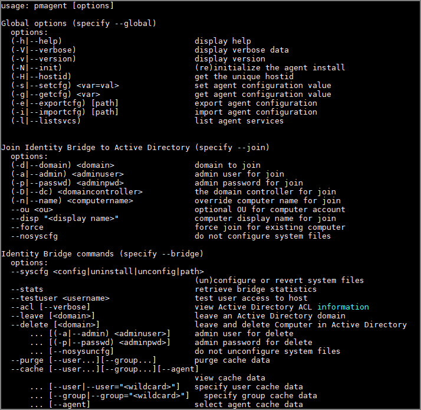

[title]: # (Agents)
[tags]: # (panel)
[priority]: # (4)
# Linux/Unix Agents

After a successful installation of the Thycotic agent on your *nix host typing `pmagent` as a privileged user or `sudo pmagent` from a non privileged user will return all the usage options that can be used in conjunction with the pmagent command.

## Topics Available

* [Installation](install/index.md)
* [Commands](commands/index.md)