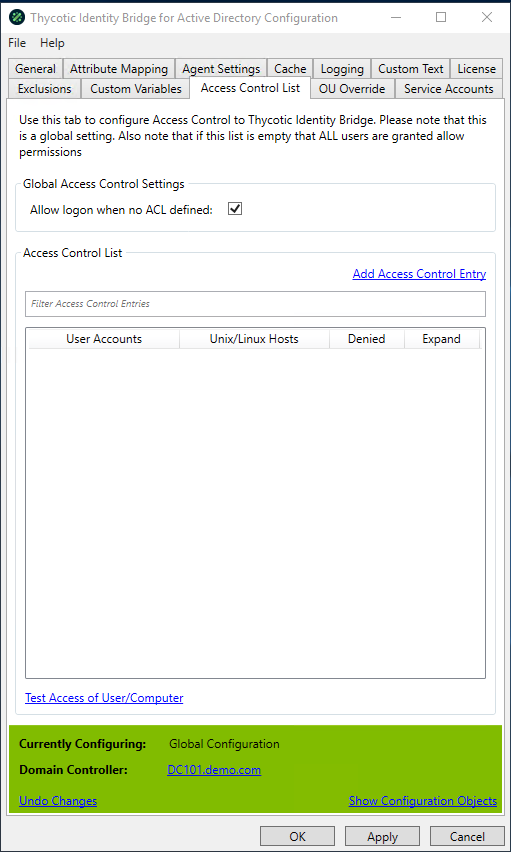

[title]: # (Access Control List)
[tags]: # (panel)
[priority]: # (4)
# Access Control List

Assign Active directory groups at a Global level to allow or deny login access to your Linux/Unix hosts.

If the Access Control List is empty All users are granted allow permissions.

For best practice a group should contain both user and computer objects, to create an effective Access Control List.

## Global Access Control Settings

### Allow logon when no ACL defined

Allows all Active Directory users logon permissions to all registered Linux/Unix hosts

* Default Allow logon when no ACL defined value: Enabled
* Once an ACL is defined, this option will become disabled and all access is controlled through the ACL definitions

### Access Control List

#### Add Access Control Entry

Opens a modal to define User or User Group and Host or Host Group definitions for individual ACLs.

* An ACL must be unique combination

#### Filter

Allows filtering of exiting ACLs defined in the display panel

#### Panel

Displays that ACL combinations of Users and Hosts defined at a Global level.

* Once an ACL has been defined all access must abide by ACL rules
* By default when an ACL is added permission for the ACL is enabled
* Denied - When selected login access to the user host combination will be denied

#### Test Access of User/Computer

Test utility provided by Thycotic that reports access of users to computers against the defined ACLs.
