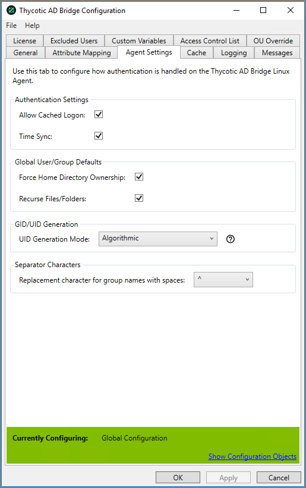

[title]: # (Agent Settings)
[tags]: # (panel)
[priority]: # (6)
# Agent Settings

Interface with Unix/Linux agents to manage settings that are passed to each agent.

## Authentication Settings

### Allow Cached Logon

Allows Active Directory Users to access Unix/Linux hosts using the encrypted cached information stored on the host

* A user must of logged onto the Unix/Linux Host previously for a cache entry to of been created.
* Default: Enabled.

### Time Sync

Updates the Unix/Linux Hosts date & time to be the same as the Domain Controller of the Active Directory.

* Synchronises date and Time upon the host joining the Domain
* Enables a service on the host to keep the time within a minute of the Domain Controller
* Default value for Time Sync: Enabled

## Global User/Group Defaults

### Expanded Group Membership

Displays Active Directory Users extended group memberships when logged into the Unix/Linux hosts.

* When Disabled, the logged in Active Directory user will only see the groups the user is a member of directly.
* When Enabled, the logged in Active Directory user will also see any additional groups the users assigned groups are members of.
* Default: Disabled

### Force Home Directory Ownership

When Active Directory users log into the Unix/Linux hosts the home directory ownership will be forcibly set to be owned by the user logging in.

* Default: Disabled

### Recurse Files/Folders

Used in conjunction with Force Home Directory Ownership, when enabled all files and folders within the user's home directory will also have the ownership set to the Active Directory user logging into the Unix/Linux host.

* Can't be enabled unless Force Home Directory Ownership is enabled
* Default: Disabled## GID/UID Generation

### UID Generation Mode

Defines the format in which the UID and GID will be generate starting from the defined Starting ID values.

* Incremental – Will select the next ID available ID for user or group starting from the defined id
  * If a value has been previously assigned and removed it will not be added back to the available pool
* Default: Algorithmic
