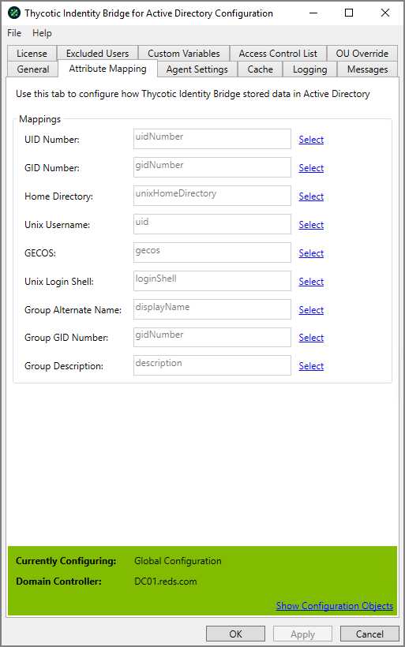

[title]: # (Attribute Mapping)
[tags]: # (panel)
[priority]: # (6)
# Installation and Upgrades

Provide the ability to directly map existing Active Directory fields to Thycotic ID Bridge fields.

We provide the ability to map attributes in the event a customer is leveraging a third party product in the AD environment that is already leveraging that value.

## UID Number

The UID Number assigned to the Active Directory user

* Default value: uidNumber
* Thycotic value
* ADUC | User Properties | Thycotic | UID Number

## GID Number

The GID Number assigned to the Active Directory Group

* Default value: gidNumber
* Thycotic value
* ADUC | Group Properties | Thycotic | GID Number

## Home Directory

* Default value: unixHomeDirectory
* Thycotic value
* ADUC | User Properties | Thycotic | Home Directory

## Unix Username

* Default value: uid
* AD value
* ADUC | User

## GECOS

* Default value: gecos
* Thycotic value
* ADUC | User Properties | Thycotic | Comment (GECOS)

## Unix User Password

* Default value: unixUserPassword
* Thycotic value
* Not a visible mapping, internally store

## Unix Login Shell

* Default value: loginShell
* Thycotic value
* ADUC → User Properties → Thycotic → Login Shell

## Group Alternative Name

* Default value: groupAltName
* Thycotic value
* ADUC → Group Properties → Thycotic → Alternative Group

## Group GID Number

* Default value: gidNumber
* Thycotic value
* Querying

## Group Description

* Default value: description
* Thycotic value
* ADUC → Group Properties → Thycotic → Description

## Group Display Name
------------------

* Default value: displayName
* AD value
* ADUC → Group
