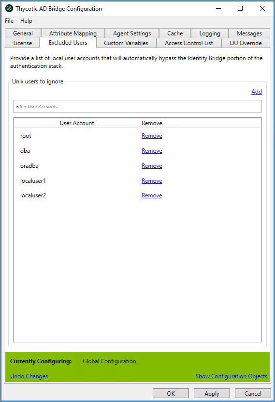

[title]: # (Authentication)
[tags]: # (panel)
[priority]: # (3)
[display]: # (none)
# Authentication Panel

## Allow Login without ACL on Server

If there is no ACL targeted on the Linux/Unix agent, allow everyone to logon, or allow no one to logon. 

* Default should be: Allow everyone

## Authentication Mode

Defined level of information required to be held within AD before allowing users access to Linux/Unix agents

* Default: Auto User Provisioning

### Auto User Provisioning

* If there is no __POSIX__ info on the user in AD (i.e. No UID/GID/Shell/Home Dir), then create the details for the user when they first login.

### Forced Bridge Enabled

* All Users must have __POSIX__ info in AD (i.e. No UID/GID/Shell/Home Dir) before they are allowed to login.

### Hybrid

* Allow for either of the above

## Re-Permission Home Directory (if required)

When a user logs into the Linux/Unix Agent it will check they have the correct home directory permissions and reset them in accordance with the UID\\GID defined in AD.

* ADUC | User Properties | Thycotic | Force Home Directory Permissions
* ADUC | Group Properties | Thycotic | Force Home Directory Permissions

## Force Local user passwords

If the user has a local Linux\\Unix account with a stored password, it will sync the password across from AD to the local store in the event the agent ever falls back to local authentication methods.

* ADUC | User Properties | Thycotic | Sync local password (linked accounts only)
* ADUC | Group Properties | Thycotic | Sync local password (linked accounts only)
