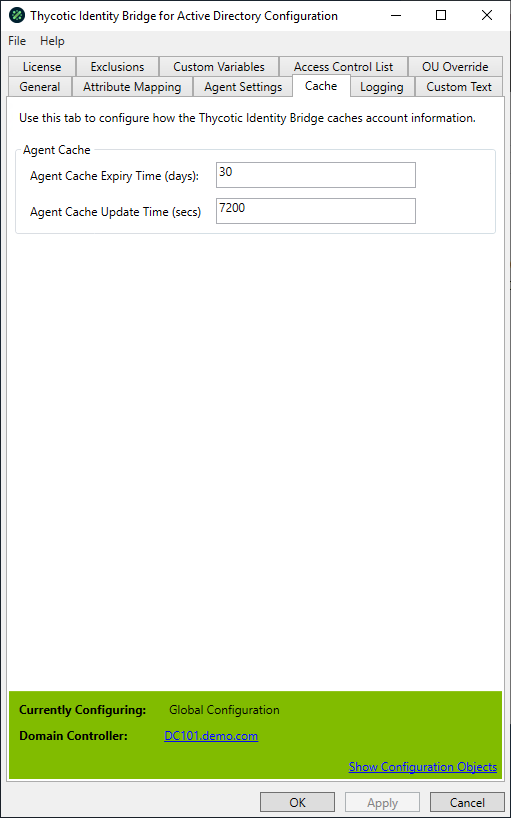

[title]: # (Cache Setting)
[tags]: # (panel)
[priority]: # (6)
# Cache Setting

Configures how the Thycotic Identity Bridge caches account information, values are sent down to the *nix Identity Bridge every 5 minutes or upon restart of the Agent.

The Cache tab contains two values:

* Agent Cache Expiry Time (days)
* Agent Cache Update Time (seconds)

These values are configurable.



## Agent Cache Expiry Time (days)

Sets the amount of time until the Agent Cache expires on a local system.

Default: 30 days

## Agent Cache Update Time

Sets the amount of time the local Linux/Unix agent will store a copy of the users password within the agent which can be used in the event the Agent is unable to contact AD to verify the users credentials. This value is user configurable, except when a trial license is in use. When licensed the Configuration Utility will enable the field and set the agents to use a default value of 7200 seconds. The field is disabled when the Identity Bridge is running with a Trial license and a hard coded value of 10 seconds on the *nix Agents, although the Configuration Utility will display the licensed default value.

* Default value: 7200 seconds with permanent key; 10 seconds with trial key

```cli
pmagent -s bridge.cachestale=7200

```
