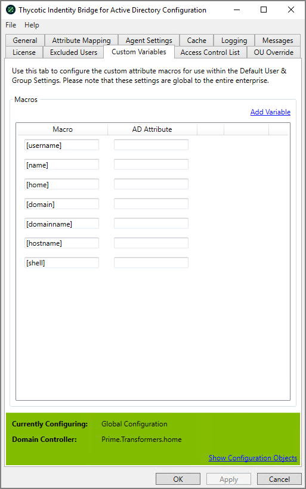

[title]: # (Customer Variables)
[tags]: # (panel)
[priority]: # (4)
# Customer Variables

Use this tab to configure the custom attribute macros for use within the Default User & Group Settings. Please note that these settings are global to the entire enterprise.

## Add Variable

Adds a new line to the panel and allows you to define a Macro name and then select from a list of Active Directory attributes and define a single attribute mapping per Macro.

## Defaults

A number of predefined default Macros have been added by Thycotic, these are also used in the Messages panel.
