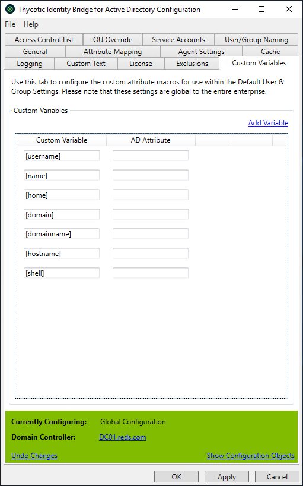

[title]: # (Custom Variables)
[tags]: # (panel)
[priority]: # (6)
# Custom Variables

Use this tab to configure the custom attribute variables for use within the Default User & Group Settings. Please note that these settings are global to the entire enterprise.

## Add Variable

Adds a new line to the panel and allows you to define a variable name and then select from a list of Active Directory attributes and define a single attribute mapping per variable.

## Defaults

A number of predefined default variables have been added by Thycotic, these are also used in the Messages panel.
