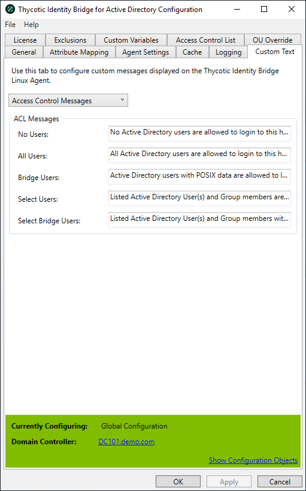

[title]: # (Access Control Messages)
[tags]: # (panel)
[priority]: # (9)
# Access Control Messages

Access Control Messages message types can be customized via the Custom Text tab in the configuration utility. These message can be displayed when running the ACL report command from the Linux/Unix agent.

Select Access Control Messages from the drop-down options.

The following message are displayed when the ACL report is run on the Linux/Unix agent by performing the following command: `pmagent --bridge --acl`

## No Users

 Message displayed when No Active Directory users have access to the Agent running the ACL report.

| Option | Description |
| ----- | ----- | 
| Default | No Active Directory users are allowed to login to this host. |
| Settings | Allow Logon when no ACL Defined: Disabled |
| | Access Control List: No ACL defined for user/host |
| General | POSIX Data for Users & Groups: Manual/Automatic |

## All Users

 Message displayed when all Active Directory users have access to the Agent running the ACL report.

| Option | Description |
| ----- | ----- | 
| Default | All Active Directory users are allowed to login to this host. |
| Settings | Allow Logon when no ACL Defined: Enabled |
| | Access Control List: No ACL defined for user/host |
| General | POSIX Data for Users & Groups: Automatic |

## Bridge Users

Message displayed for Active Directory users with POSIX data defined and have access to the Agent running the ACL report.

| Option | Description |
| ----- | ----- |
| Default | Active Directory users with POSIX data are allowed to login to this host. |
| Settings | Allow Logon when no ACL Defined: Enabled |
| | Access Control List: No ACL defined for user/host |
| General | POSIX Data for Users & Groups: Manual |

## Select Users

Message displayed when Active Directory users and group members defined within the configuration utility ACL panel have access to the Agent running the ACL report.

| Option | Description |
| ----- | ----- |
| Default | Listed Active Directory User(s) and Group members are allowed to login to this host. |
| Settings | Allow Logon when no ACL Defined: Enabled (not changeable) |
| | Access Control List: No ACL defined for user/host |
| General | POSIX Data for Users & Groups: Automatic |

## Select Bridge Users

Message displayed for Active Directory users and group members defined within the configuration utility ACL panel with POSIX data defined to have access to the Agent running the ACL report.

| Option | Description |
| ----- | ----- |
| Default | Listed Active Directory User(s) and Group members with POSIX data are allowed to login to this host. |
| Settings | Allow Logon when no ACL Defined: Enabled (not changeable) |
| | Access Control List: No ACL defined for user/host |
| General | POSIX Data for Users & Groups: Manual |
