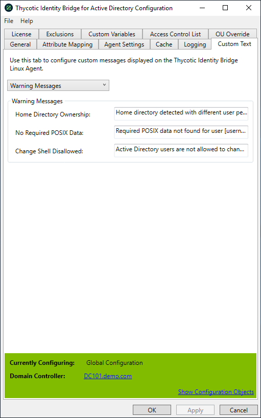

[title]: # (Warning Messages)
[tags]: # (panel)
[priority]: # (8)
# Warning Messages

Warning Messages message types can be customized via the Custom Text tab in the configuration utility.

Select Warning Messages from the drop-down options.

Messages displayed to all Active Directory users when configuration discrepancies occur.

* Supports customer variables in the message field, such as [username] and [hostname]

## Home Directory Ownership

Displayed when Active Directory user logs into Linux/Unix host and home directory location exists, but with different ownership rights.

* Default Home Directory Ownership value: Home directory detected with different user permissions

## No Required POSIX Data

Displayed when Active Directory users require POSIX data to be defined in ADUC before being able to access Linux/Unix hosts.

* Default No Required POSIX Data value: Required POSIX data not found for user [username]

## Change Shell Disallowed

Displayed when the Active Directory user attempts to change their Linux/Unix default shell type.

* Default: Active Directory users are not allowed to change their assigned shell.