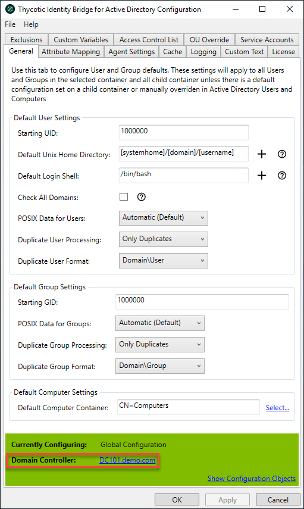

[title]: # (DC Selector)
[tags]: # (domain controller)
[priority]: # (5)
# Domain Controller Selector

When the Configuration Utility is opened, it connects to the nearest Domain Controller according to the environmental setup in Active Directory Sites and Services.

Users can change the connected Domain Controller on their Configuration Utility pages. At the bottom of each utility tab is the Domain Controller information. Click on the link to select a different Domain Controller.

A modal opens, displaying available Domain Controllers for the users environment.

