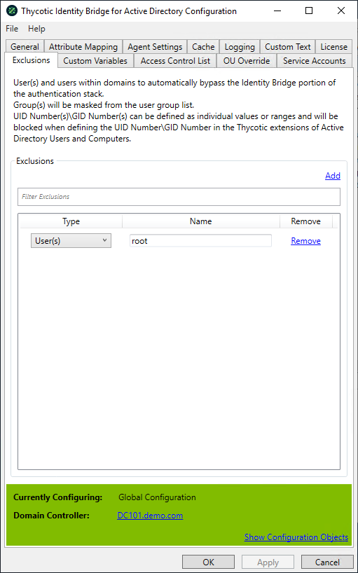

[title]: # (Excluded Users)
[tags]: # (panel)
[priority]: # (3)
# Excluded Users

Allows to provide a list of local user accounts that will automatically bypass the Identity Bridge portion of the authentication stack.

## Unix users to ignore

### Add

Open a text based modal where the Linux/Unix username can be defined and added to the list of excluded user.

### Filter

Allows the defined excluded user list to be filtered.

### Panel

Displays the defined excluded user and the ability to remove them from the list.

* Root is added by default
