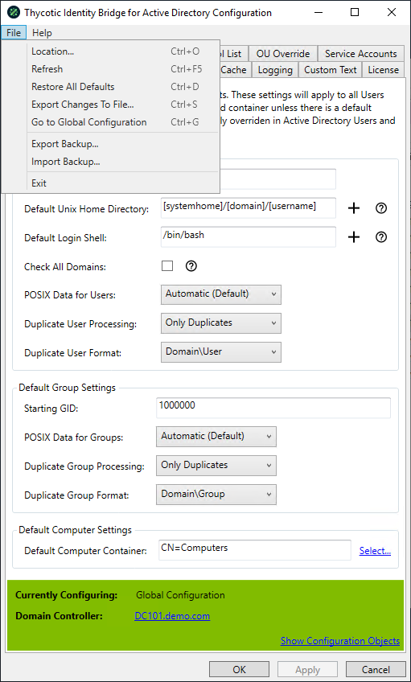

[title]: # (File Menu)
[tags]: # (panel)
[priority]: # (5)
# File Menu - Import/Export Backup

The Thycotic Identity Bridge Configuration Utility provides the ability to Export and Import all settings from the Configuration Utility via a backup file (.IBBAK).

The functionality can be accessed view the File Menu and the menu items are __Export Backup__ and __Import Backup__.

## Export Backup

Opens a modal to provide a location and name for the settings to be exported to. Any applied licenses will not be included in the export.

## Import Backup

Provides a modal to select a previously created backup.

## Backup Files

Backup files can be edited using a standard text editor. Exercise caution when modifying backup files as not to cause corruption.

>**Warning**: Exporting and and Importing backups across different domains connected to the Identity Bridge Configuration Utility may cause unexpected behavior. Backups contain settings that are domain specific based on the domain they were created in and not all domains contain the same structures or information.
