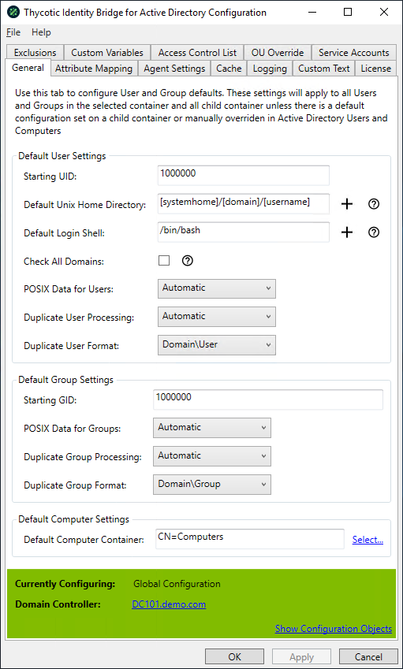

[title]: # (General)
[tags]: # (panel)
[priority]: # (3)
# The General Panel

Default settings of values for User and Group attributes, including starting id’s, default home and shell parameters.

## Default User Settings

### Starting UID

The base UID that should be taken as starting point for all uid assignments

* Default Starting UID: value should be 1000000
* Only positive numeric characters can be set
* A maximum of 9 numeric characters can be used

### Default Home Directory

Setting of the path that should be used for users when logging into the Linux/Unix host

* Default Home Directory set to: [systemhome]/[domain]/[username]

### Default Login Shell

Define the shell you would like assigned to the user when logging into the Linux/Unix host

* Initial Default Login Shell should be set to: `/bin/bash`

### Primary Group Name

The Active Directory Group that will be assigned as the Users Primary group when logging into Linux/Unix Host.

* Default Primary Group Name: Not set by Default
* Use the select option to activate the Active Directory Group Selection Modal

### Primary Group Number

Displays the Thycotic assigned GID value for the Active Directory Group assigned to the Primary Group Name.

### Check All Domains

This setting forces searches to halt if a domain being searched is offline If this setting is disabled, such domains will be ignored and the search will continue on available domains.

* Check All Domains unchecked by Default

### POSIX Data for Users & Groups

Defines if all POSIX data to be defined by Active Directory before Users are able to login into the Linux/Unix Hosts.

* Default POSIX Data for Users & Groups: Automatic
* Automatic - If there is no POSIX date on the user in Active Directory (i.e. No UID/GID/Shell/Home Dir), then create the data for the user upon first logon to a Linux/Unix Host
* Manual - POSIX data will need to be generated for each User and Group in ADUC before being able to access Linux/Unix Hostsic – Drop down should be present and can be changed

## Default Group Settings

### Starting GID

The starting GID that will be taken as starting point for all gid assignments.

* Initial Starting GID: value should be 1000000
* Only positive numeric characters can be set
* A maximum of 9 numeric characters can be used

## Default Computer Settings

### Default Computer Container

Defines the default OU container that Linux\Unix Hosts joining the Active Domain will be placed in.

* Default Computer Container should be set to: CN=Computers