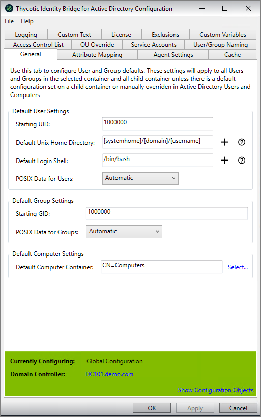

[title]: # (General)
[tags]: # (panel)
[priority]: # (5)
# The General Panel

Default settings of values for User and Group attributes, including starting id’s, default home and shell parameters.

## Default User Settings

### Starting UID

The base UID that should be taken as starting point for all uid assignments

* Default: value should be 1000000
* Only positive numeric characters can be set
* A maximum of 9 numeric characters can be used

### Default Home Directory

Setting of the path that should be used for users when logging into the Linux/Unix host

* Default: [systemhome]/[domain]/[username]

### Default Login Shell

Define the shell you would like assigned to the user when logging into the Linux/Unix host

* Default: `/bin/bash`

### Check All Domains

This setting forces searches to halt if a domain being searched is offline If this setting is disabled, such domains will be ignored and the search will continue on available domains.

* Check All Domains unchecked by Default

### POSIX Data for Users

Defines if User POSIX data to be defined by Active Directory before Users are able to login into the Linux/Unix Hosts.

* Default: Automatic
* Automatic (Default) - If there is no POSIX date on the user in Active Directory (i.e. No UID/GID/Shell/Home Dir), then create the data for the user upon first logon to a Linux/Unix Host.
* Manual - POSIX data will need to be generated for each User and Group in ADUC before being able to access Linux/Unix Hostsic - Drop down should be present and can be changed.
* Always - Always generate POSIX data even if already set on user object.

<!--
#### Duplicate User Mode

* Default: Prepend Automatically
* Ignore Duplicates - Faster, but may break certain users or provide confusing group lists with the ID command.
* Duplicates Only - Any duplicate user name found in another domain that is not the domain where the computer is joined.
* Prepend Automatically
* Prepend Always

Example:  `Domain^Users` and `Domain_Admins`, that may need to show up as `Domain\Group^Name` if the user belongs to both.

#### Duplicate User Format
-->

## Default Group Settings

### Starting GID

The starting GID that will be taken as starting point for all gid assignments.

* Default: value should be 1000000.
* Only positive numeric characters can be set.
* A maximum of 9 numeric characters can be used.

### POSIX Data for Groups

Defines if Group POSIX data to be defined by Active Directory before Users are able to login into the Linux\Unix Hosts

* Default: Automatic
* Automatic (Default) - If there is no POSIX date on the user in Active Directory (i.e. No UID/GID/Shell/Home Dir), then create the data for the user upon first logon to a Linux/Unix Host.
* Manual - POSIX data will need to be generated for each User and Group in ADUC before being able to access Linux/Unix Hosts.
* Primary Group Only - Generate GID for users primary group if Primary Group does not have an existing GID.
* Always - Always generate POSIX data even if already set on group object.

## Default Computer Settings

### Default Computer Container

Defines the default OU container for Linux/Unix Hosts joining the Active Domain.

* Default: CN=Computers
