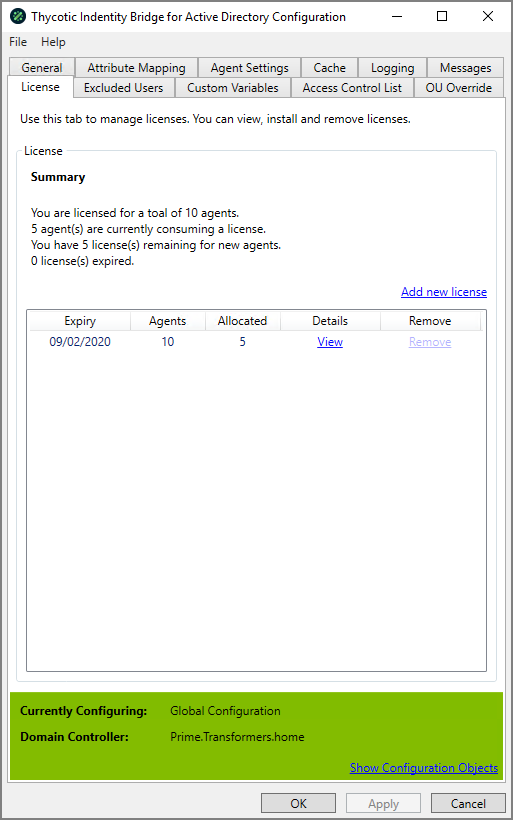

[title]: # (Licensing)
[tags]: # (panel)
[priority]: # (3)
# Licensing

Licensing Panel to view, add, and remove Thycotic Identity Bridge Licenses.

* Multiple licenses can be applied
* Licenses apart from the Trial license can be removed

## Default Trial License

By default installing the Thycotic Identity Bridge a 10 agent Trial license is provided with a 30 day expiry.

## Add new license

Provides a modal to allow addition of Thycotic allocated licenses.
