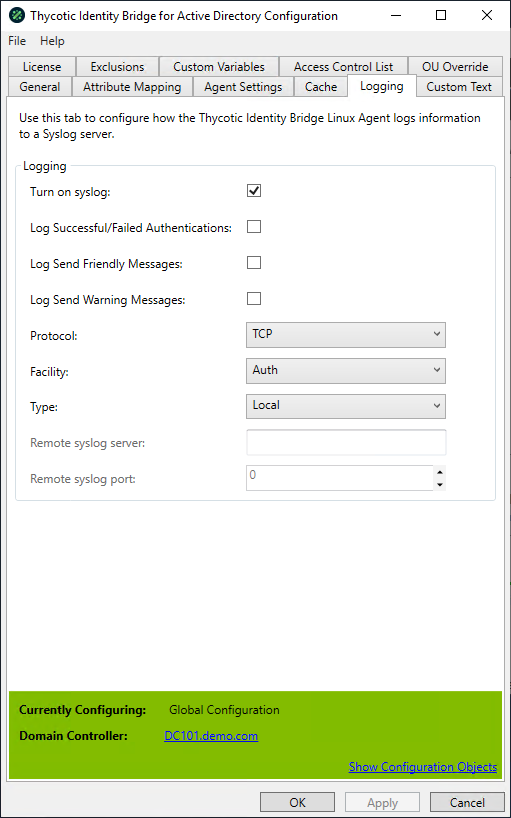

[title]: # (Logging)
[tags]: # (panel)
[priority]: # (3)
# Logging

Allows the Linux/Unix host to utilise SysLog functionality, either logging the agent information locally or to a defined remote SysLog server.

## Logging

### Turn on SysLog

Defines if Agent logging also sent to SysLog as well as existing agent pmlog.

* Default Turn on SysLog value: Disabled

### Protocol

The communication protocol used to send Linux/Unix host information to SysLog.

* Default Protocol value: TCP

### Facility

Defines the Linux\Unix host process component that will be sent to the SysLog.

* Default Facility value: Auth

### Type

Defines if Linux\Unix host will use a local or remote SysLog server.

* Default Type value: Local
* If remote selected the Remote SysLog server and Remote SysLog port fields will become enabled

### Remote SysLog Server

Defines the address of the remote SysLog server to which the Linux/Unix hosts send their defined SysLog information.

* Default Remote SysLog server value: Blank
* When enabled defined by the resolvable host name or IP address

### Remote SysLog Port

Defines the port SysLog uses for communication.

* Default Remote SysLog port value: 0
