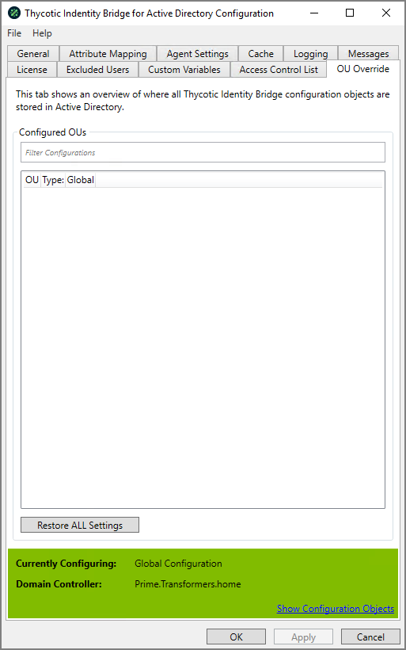

[title]: # (OU Override)
[tags]: # (panel)
[priority]: # (5)
# OU Override

Shows an overview of where all Thycotic Identity Bridge configuration objects are stored in Active Directory.

## Configured OUs

### Filter

Allows filtering of Configured OU’s defined in the display panel.

### Restore ALL Settings

Will restore all configuration settings back to defaults, as if clean install has been performed.
