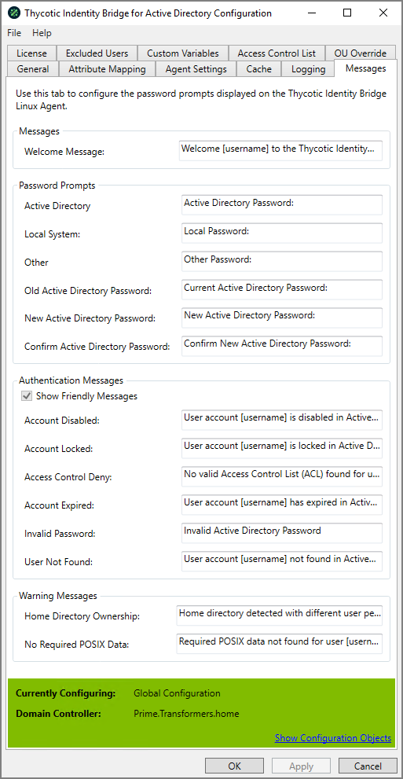

[title]: # (Messages)
[tags]: # (panel)
[priority]: # (3)
# Messages

The prompt that will be displayed to the user on the Linux/Unix host during login.

## Messages

### Welcome Message

Message displayed to all Active Directory users as they login to the Linux/Unix Hosts

* Supports customer variables in the message field, such as [username] and [hostname]
* Default Welcome Message: Welcome [username] to the Thycotic Identity Bridge on [hostname]

## Password Prompts

This section covers the various type of password messages that can be displayed users.

* Password prompts do not support custom variables in the message fields

### Active Directory

Password prompt text displayed to Active Directory users when logging into Linux/Unix host

* Default Active Directory value: Active Directory Password

### Local System

Password prompt text displayed to locally defined Linux/Unix users when logging into Linux/Unix host.

* Default Local System value: Local Password:

### Other

Password prompt text displayed when user accessing Linux/Unix host via 3rd party remote user credential service.

* Default Other value: Other Password

### Old Active Directory Password

Displayed when Active Directory users are changing their password on the Linux/Unix host.

* Request to define users existing password
* Default Old Active Directory Password value: Current Active Directory Password

### New Active Directory Password

Displayed when Active Directory users are changing their password on the Linux/Unix host.

* Request to enter a new password
* Default New Active Directory Password value: New Active Directory Password:

### Confirm New Active Directory Password

Displayed when Active Directory users are changing their password on the Linux/Unix host.

* Request to confirm new password
* Default Confirm New Active Directory Password value: Confirm New Active Directory Password

## Authentication Messages

Messages displayed to all Active Directory users when various Active Directory states discovered upon logging into Linux/Unix hosts

* Supports customer variables in the message field, such as [username] and [hostname]

### Show Friendly Messages

Option to enable/disable all Authentication messages.

* With trial license inplace, option will be defaulted to enabled.
* When a perpetual license applied, option will be defaulted to disabled, although can be enabled.

### Account Disabled

Displayed when Active Directory user has been disabled within ADUC.

* Default Account Disabled value: User account [username] is disabled in Active Directory

### Account Locked

Displayed when Active Directory user account has become locked through to many invalid password attempts

* Default Account Locked value: User account [username] is locked in Active Directory

### Access Control Deny

Displayed when Active Directory user does not have a valid Access Control list entry within the Thycotic Configuration Utility

* Default Access Control Deny value: No valid Access Control List (ACL) found for user [username] on [hostname]

### Account Expired

Displayed when Active Directory user account has passed defined Account epirey value in ADUC.

* Default Account Expired value: User account [username] has expired in Active Directory.

### Invalid Password

Displayed when Active Directory user enters an invalid password.

* Default Invalid Password value: Invalid Active Directory Password

### User Not Found

Displayed when username entered can not be found within Active Directory.

* Default User Not Found value: User account [username] not found in Active Directory

## Warning Messages

Messages displayed to all Active Directory users when configuration discrepancies occur.

* Supports customer variables in the message field, such as [username] and [hostname]

### Home Directory Ownership

Displayed when Active Directory user logs into Linux/Unix host and home directory location exists, but with different ownership rights.

* Default Home Directory Ownership value: Home directory detected with different user permissions

### No Required POSIX Data

Displayed when Active Directory users require POSIX data to be defined in ADUC before being able to access Linux/Unix hosts.

* Default No Required POSIX Data value: Required POSIX data not found for user [username]