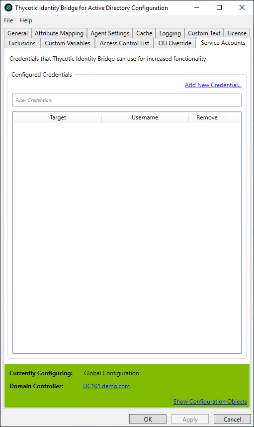

[title]: # (Service Accounts)
[tags]: # (panel)
[priority]: # (6)
# Service Accounts

Service Accounts allow to define Active Directory accounts across different domains that Identity Bridge can utilise to function effectively across multi-domain environments.

## Configured Credentials

### Add New Credentials

Opens a new modal that allows to define the domain, username and password of the credentials to access domains within the Active Directory environment.

### Filter

Allows filtering of existing Credentials defined in the display panel.

#### Panel

Displays the Target Domain and Username for the Configured Credentials. A remove option is available.

>**Note**: Defined Configured Credentials won't be included in Identity Bridge Configuration exports.
