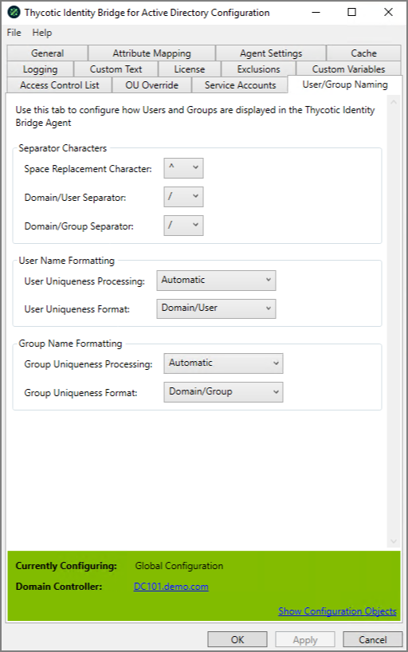

[title]: # (User/Group Naming)
[tags]: # (panel)
[priority]: # (6)
# User/Group Naming Tab

Used to configure how Users and Groups are displayed.

## Separator Characters

### Space Replacement Character

Defines how spaces in User and Group names will be displayed on the Unix/Linux hosts.

Default: __^__

### Domain/User Separator

Defines how the separator between the Domain and User name is displayed.

Default: __/__

### Domain/Group Separator

Defines how the separator between the Domain and Group name is displayed.

Default: __/__

## User Name Formatting

### User Uniqueness Processing

Defines how Identity Bridge will process Duplicate Active Directory usernames when user logs into the Unix/Linux Hosts

* Default: Automatic
* Never - Ignore Duplicate users
* Automatic - Generates a unique user name by adding or appending the domain information to the user for all domains except for the joined domain.
* Only Duplicates - Generates a unique user name by adding or appending the domain information to the user when a duplicate name is detected.
* Always - Generates a unique user name by adding or appending the domain information to the user for all domains.

### User Uniqueness Format

Defines the order in which the Active Directory username will be displayed on the Unix/Linux Host when the Active Directory username is duplicated due to a Multi Active Domain environment

* Default: Domain/User
* The selection will reflect the defined Domain/User Separator.

## Group Name Formatting

### Group Uniqueness Processing

Defines how Identity Bridge will process Duplicate Active Directory groups with users logging into the Linux\Unix Hosts

* Default: Automatic
* Never - Ignore Duplicate groups
* Automatic - Generates a unique group name by adding or appending the domain information to the group for all domains except for the joined domain.
* Only Duplicates - Generates a unique group name by adding or appending the domain information to the group when a duplicate name is detected.
* Always - Generates a unique group name by adding or appending the domain information to the group for all domains.

### Group Uniqueness Format

Defines the order in which the Active Directory group will be displayed on the Unix/Linux Host when the Active Directory username is duplicated due to a Multi Active Domain environment.

* Default: Domain/Group
* The selection will reflect the defined Domain/Group Separator.
