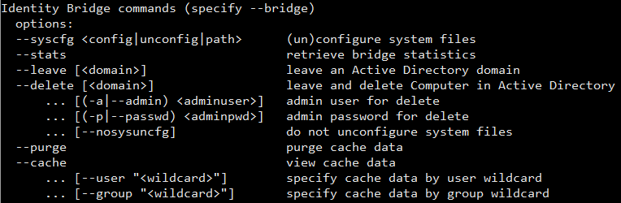

[title]: # (Commands)
[tags]: # (panel)
[priority]: # (14)
# Identity Bridge Commands



## Prerequisites

Root access or a user with root sudo permissions.

## --bridge Command Line Options

Once your Thycotic Identity bridge agent has been joined to Active Directory there are a number of other commands that you can utilise in conjunction with the __--bridge__ option and these are identified below

### --syscfg <config|unconfig|path>

Allows you to configure/unconfigure the hosts native authentication files for the Thycotic system configuration files to authenticate against your Active Directory Domain.

Thycotic uses json scripts to modify the hosts original authentication files. Before any __--syscfg__ configuration any files to be modified are backed up. The Path option allows you to define an alternative json script to be used for the configuration of the hosts authentication files. This would be used when customers have specific alterations already defined on their hosts.

The default Thycotic scripts can be found in:
* /opt/thycotic/scripts

Files currently modified by __--syscfg__:

* /etc/pam.d/password-auth
* /etc/pam.d/passwd
* /etc/nsswitch.conf
* /etc/ssh/ssh_config
* /etc/ssh/sshd_config

### --stats

Provides on screen feedback of the status of the agent, including Process Id and currently active AD instance.

Useful commands to check under which OU the agent is defined and running.

### --leave [<domain>]

Leaves the Active Directory domain, although leaving the computer object in Active Directory. As the leave process completes the --syscfg uncfg will be run, reverting the host back to its original authentication configuration and removing the Thycotic system configuration files.

Leave will clear all Active Directory setting on the host, it will clear all cached information. Defining the Domain is not required, if not defined the agent will use it’s stored details for the Domain.

Optional: `--nosysuncfg` stops the removal of the Thycotic system configuration files.

Do not unconfigure system files.

### --delete

Leaves the Active Directory domain, also deleting the computer object in Active Directory. Although to complete the Delete command you will be required to provide the Domain, Admin username and Password. As the Delete process completes the --syscfg uncfg will be run, reverting the host back to it’s original authentication configuration and removing the Thycotic system configuration files.

* `[(-a|--admin) <adminuser>]` admin user for delete
* `[(-p|--passwd) <adminpwd>]` admin password for delete
* `[--nosysuncfg]` do not unconfigure system files

Delete can be completed solely through command line input or interactively. Interactively will default to showing the Domain the agent is currently joined to.

Optional: `--nosysuncfg` stops the removal of the Thycotic system configuration files.

### --purge

Purge allows the deletion of the locally cached data stored on the agent. The purge can remove all user and group cached information or be filtered to down to individual user and group level.

* `[--user "<wildcard>"]` specify cache data by user wildcard
* `[--group "<wildcard>"]` specify cache data by group wildcard

The purge will only remove the locally cached information regarding users and groups on that Agent. The cached information is used to reduce user/group look up times in Active Directory and provide authentication in the event the Domain is unavailable.

The default of --purge will delete all information.  You may use * wildcard matching and/or [Aa] for case matching.

### --cache

Displays the cached information for the agent, users and groups. The cache can be displayed for all 3 categories or filtered to down to individual user and group level.

* `[--user "<wildcard>"]` specify cache data by user wildcard
* `[--group "<wildcard>"]` specify cache data by group wildcard

The cached information is used to reduce user/group look up times in Active Directory and provide authentication in the event the Domain is unavailable. 

The default of --cache will display all information.  You may use * wildcard matching and/or [Aa] for case matching. 

>**Note**: The format of the cache output is subject to change and is of no particular format.

## --bridge Examples

### Syscfg

`--bridge --syscfg /root/thycotic/corp-config.json`

Rather than using the default /opt/thycotic/scripts/ to configure or unconfigure the authentication system files, the agent will call /root/thycotic/corp-config.json

### Stats

`pmagent --bridge --stats`

Example output:

```
Process ID: 3770
Threads: 15
Started: Wed Jun 17 10:49:22 2020
Last Accessed: Wed Jun 17 11:16:21 2020
Status: running,connected,joined
Current Client Processes: 0
NSS Requests: 130
PAM Requests: 4
Current Joined Domain: DEMO
Computer name: AGENT1
OU: CN=Computers,DC=Demo,DC=com
```

### Leave

`pmagent --bridge --leave --nosysuncfg`

This will leave the current Active Directory domain.

The `--nosysuncfg` mean that the Thycotic authentication system files will remain in place.

* The `--bridge --syscfg unconfig` will not be run at the end of the leave.

### Delete

`pmagent --bridge --delete`

You will be prompted interactively to complete the deletion process.

1. Enter domain (default: DEMO):  
1. Enter Active Directory username: *Administrator*  
1. Enter *Administrator*\@Demo's password:  
1. Successful.

### Cache

`pmagent --bridge --cache --user [Tt]est\*`

* Using both Character casing and wildcard matching
* Following the successful authentication of an AD user to your *nix host you can recall the cached information for that user.

Example output:

```
{
    "users": [
    {
        "usid": "S-1-5-21-4211583412-2907095826-1833522802-3360",
        "name": "test1",
        "sam": "DEMO/test1",
        "principal": "test1\@DEMO.COM",
        "linked": 0,
        "uid": 336001,
        "gid": 513,
        "gecos": "",
        "home": "{target home root}/DEMO/test1",
        "shell": "/bin/bash",
        "lastUp": 1592387573,
        "expires": 159663333,
        "data": {
            "userName": "test1",
            "userPrincipalName": "test1\@Demo.com",
            "KerberosName": "test1\@Demo.com",
            "unixLoginName": "test1",
            "unixLoginShell": "/bin/bash",
            "unixHomeDirectory": "{target home root}/DEMO/test1",
            "uidNumber": 336001,
            "gidNumber": 513,
            "sid": "S-1-5-21-4211583412-2907095826-1833522802-3360",
            "gecos": null,
            "groupDescription": null,
            "nETBIOSDomainName": "DEMO",
            "forceHomeDirPermissions": false,
            "syncLocalPassword": false,
            "passThrough": false,
            "linkedUser": false,
            "accountExpires": 910692730085,
            "passwordExpired": false,
            "accountLocked": false,
            "accountDisabled": false,
            "accessDenied": false,
            "groups": [
                {
                    "gidNumber": 667,
                    "name": "group2",
                    "altname": "group2",
                    "description": null,
                    "sid": "S-1-5-21-4211583412-2907095826-1833522802-3105"
                },
                {
                    "gidNumber": 666,
                    "name": "group1",
                    "altname": "group1",
                    "description": null,
                    "sid": "S-1-5-21-4211583412-2907095826-1833522802-3104"
                },
                {
                    "gidNumber": 513,
                    "name": "DomainUsers",
                    "altname": "DomainUsers",
                    "description": "Alldomainusers",
                    "sid": "S-1-5-21-4211583412-2907095826-1833522802-513"
                }
            ]
        },
        "groups": [
            "DomainUsers",
            "group1",
            "group2"
            ]
        }
    ]
}
```

### Purge

`pmagent --bridge --purge`
`pmagent --bridge --cache --user *`

* This will purge all cached user and group information from the agent
* Follow a purge this is the output you would see from checking the user cache

```
{
   "users": []
}
```
