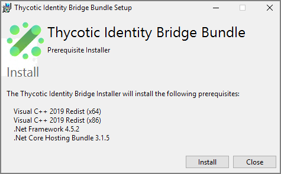
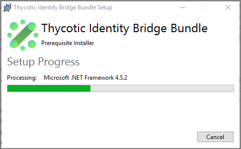
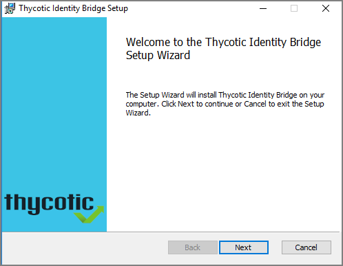
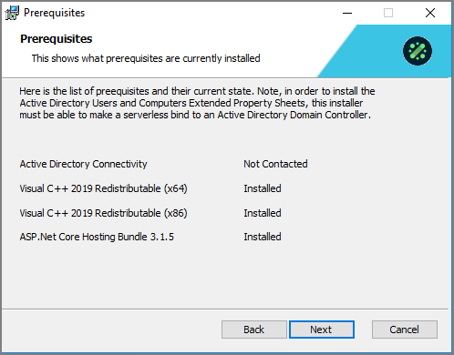
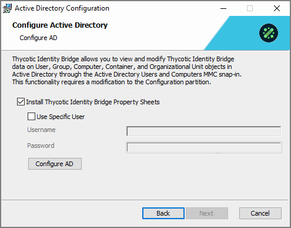
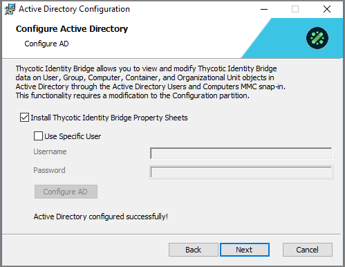
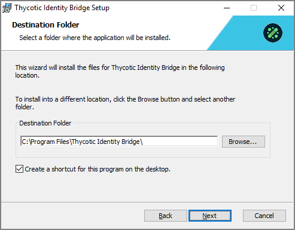
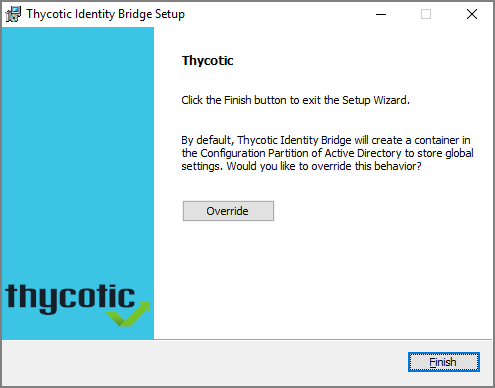
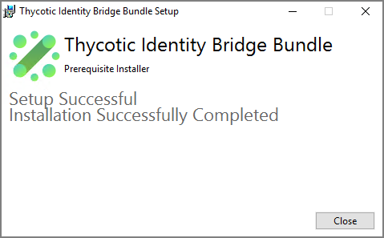
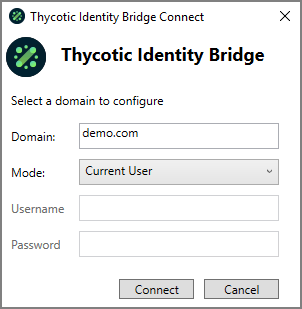

[title]: # (.exe Install)
[tags]: # (setup)
[priority]: # (4)
# Installing the Thycotic Identity Bridge for Windows .exe file

The executable for the Identity Bride installation on Windows systems, checks for prerequisites and installed those before entering the actual product installation.

1. Double-click the downloaded Identity Bridge for Windows install executable.
1. The Thycotic Identity Bridge Bundle installer opens, click __Install__.

   
1. The installer shows the progress of the prerequisites verification and installation.

   

   Once the prerequisites are applied the Installation wizard opens, click __Next__.

   
1. The install wizard shows the installed Prerequisites, click __Next__.

   
1. When Active Directory is detected, the Configure Active Directory dialog opens to the following:

   

   * Check the Install Thycotic Identity Bridge Property Sheets checkbox.
   * If you are logged in as the default user (Administrator), ignore the specific user detail setup.
   * Click __Configure AD__.
1. A successful AD Configuration is confirmed:

   

   Click __Next__.
1. Confirm or change the default Destination Folder path:

   

   Click __Next__.
1. Click __Finish__ once the setup completes.

   
1. On the Setup Successful dialog, click __Close__.

   

You are now ready to open the Identity Bridge application, it will open to the Thycotic Identity Bridge Connect dialog.

If you are the default user, you only need to click __Connect__. The Domain should have been automatically entered and the Mode drop-down is on the Current User option.

Refer to [Identity Bridge Configuration Utility](../../cfg-util/index.md) for details about the features of the configuration utility.
