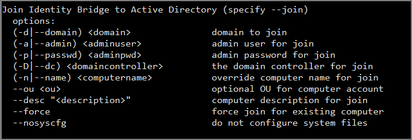

[title]: # (Join Agent to AD)
[tags]: # (setup)
[priority]: # (2)
# Joining *nix Agents to an Active Directory Domain



This page describes the process and options for joining your *nix agent to an Active Directory domain using Thycotic’s Identity Bridge solution.

## Prerequisites

Before being able to join you *nix host to a domain the following requirements will need to be met

* DNS and routing must be correct
  * DNS record for agent
  * Agent must be able to resolve the domain and domain controller
* Thycotic Agent installed on the *nix host
* Access to an Active Directory Account with permissions to add computer objects
* SELinux to be disabled on the *nix host otherwise the authentication to Active directory will be impacted.
  * The Thycotic Agent installer will post a message if detected
* Root access or a user with root sudo permissions

## Overview

In order for your *nix agent to Join an available Active directory domain you will need to run the pmagent --join command. This will contact an available dc within you domain and add your \*nix host as a computer object to that domain.

You can perform the join solely from using command line arguments or through an interactive method where you will be prompted to provide the required details.

As the Join process completes and the agent is registered, the join process will also configure the Thycotic agents system file configuration to allow
authentication to pass through to Active Directory. This option can be skipped if required.

The command line also allows additional optional configuration options to be included in the Join, these will be details below.

## Existing Computer objects

If a computer object of the same name already exists within the AD the Join will overwrite the record with a new one for that host, as long as that computer object has no password (has never been actively used).

There is a force option to allow the overwrite of any computer object (however, this must be used with extreme caution)

Future: if an alternative host was registered with the now overwritten computer record it will cease to function and indicated within the logging. The host will then need to be joined back into the domain.

## Command Line Options

Command line options for joining your \*nix hosts to the Active directory domain

| **Command line option** | **Description** | **Notes** |
| ----- | ----- | ----- |
| --join *<domain>*  | Base argument to Join an Active Directory domain must be present before any other argument listed below | The domain you wish to join can be added after Only argument required |
| -d \| --domain | Specify the Domain you wish to join | Short and Long domain can be used, Demo or Demo.com |
| -a \| --admin *<adminuser>* | Specify an Active Directory admin user with privileges for join the domain | **Accepted Input formats of <adminuser>** |
|                         |                 | **Username:**                                                                                         |
|                         |                 | Administrator **LDAP:**                                                                               |
|                         |                 | ”CN=Administrator,CN=Users,DC=Domain,DC=com” **User Principal Name (must be configured in AD):**      |
|                         |                 | Administrator\@Domain.com **Down-Level Logon Name:**                                                  |
|                         |                 | Domain\\\\Administrator (Requires \\\\ as \\ in \*nix is an escape character)                         |
| -p \| --passwd *<adminpwd>* | Specify password for admin user |             |
| -D \| --dc *<domaincontroller>* | Specify a domain controller for join to be executed against | Optional - Provides a defined DC for performing the Join Effective when multiple DC available for a Domain   |
| -n \| --name *<computername>* | Specify the computer name for join | Optional - Uses the hostname of the \*nix host by default |
| --desc *<"description">*    | Specify the computer description for join | Optional - Uses the FQDN of the \*nix host by default |
| \--ou <ou> | Specify an alternative OU for the computer object to be placed in | Optional - Uses the Active Directories default of Computers to locate the computer object |
|                         |                 | Example usage:                                                                                        |
|                         |                 | --ou OU=CentOS,OU=Non-Windows,DC=Demo,DC=com                                                          |
| --nosyscfg | Will not configure the agents systems configuration files for AD authentication | Optional - By default the Join process will run the --bridge --syscfg config at the end of the process to allow AD users to authenticate to the agent. |
|                         |                 | This optional will stop the --bridge --syscfg config from being run |
| --force                | Allows the join to overwrite an existing computer record within the AD regardless of the existing computer objects status | **Caution!!**  Optional - Using the force option could stop other previously registered hosts from working or a computer of higher importance could be overwritten by mistake |

>**Note**: When using the command line method to join Active directory is the pmagent service is not running before the join, you will need to manually start it after. If the service was already running, it will be automatically restarted 

## Expected output of Successful Join

Following the completion of either CLI or Interactive join to AD you should expect to see the following type of output:

```bash
Successfully Joined domain: DEMO.COM  
Domain Controller: DC01.Demo.com  
With User: Administrator  
Computer name: Agent01  
In OU: CN=Computers,DC=Demo,DC=com  
Description: [Agent01.Demo.com](http://DC01.Demo.com)

(Re)starting Identity Bridge Service
```

## CLI Examples

`pmagent --join *Domain*`

* User will be prompted for Admin user and Password

`pmagent --join *Domain.com* -a "*CN=Administrator,CN=Users,DC=Domain,DC=com"*`

* User will be prompted for Administrator Password

`pmagent --join *Domain.com* -p *Password*`

* User will be prompted for Admin user

`pmagent --join *Domain.com* -a *Administrator\@Domain.com* -p *Password* -D *DC01*`

* DC01 will be contacted to perform the join command

`pmagent --join *Domain.com* -a *Domain\\\\Administrator* -p *Password* -n *Linux_Agent*`

* Will create a computer object with a name of LINUX_AGENT1

`pmagent --join -a *Administrator\@Domain.com* -p *Password* -desc “This is a Thycotic IB Agent”`

* Will be prompted to provide a Domain to join

* Will create a computer object with a description of This is a Thycotic IB
    Agent

`pmagent --join -d *Domain.com* -a *Administrator* -p *Password* -D *DC01* -n *Linux_Agent* -desc “This is a Thycotic IB Agent” --ou OU=CentOS,OU=Non-Windows,DC=Demo,DC=com --nosyscfg`

* Example with all options defined

* Computer object will be created in the Non-Windows → CentOS folder

## Fully Interactive Example

`pmagent --join`

* User will be prompted to provide Domain, Admin User and Password
  * Enter domain:  
    * Enter Active Directory username:  
    * Enter *AD User@Domain.com*'s password:

Any required command line option not included, the user will be prompted to provide interactively
